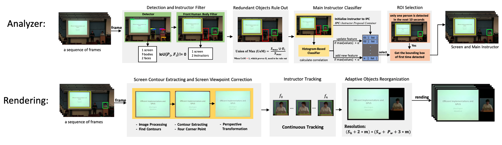
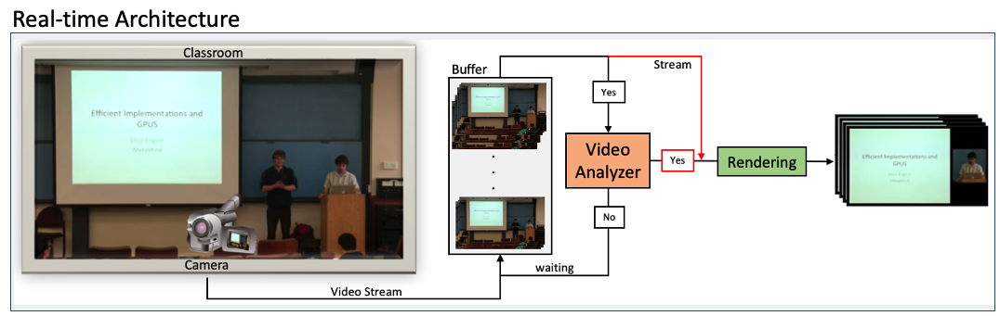

# A Hybrid Method for Extracting and Reoframing Objects in Lecture Video       

Lecture videos are good sources to learn something new and deserve to be treasured. After shooting, the videos without post-processing are usually posted on the internet directly due to the technology and resources limitations. Better, it be reprocessed to get highly-quality by consuming more time and resources. We investigate the problem of automatically extracting key information from a lecture video in different scenarios. The goal of this thesis is to extract main instructor and screen from a raw live lecture video and then to combine them to generate a new layout-video with less file size than original. Another pro of this hybrid approach is that we can apply highly accurate object detection methods without as much of the computational burden. We make the following four contributions: **1) We built an intelligent video reframing pipeline system for extracting and reframing objects from lecture video; 2) We propose a post-processing method to localize the frontal human body position in a sequence of video; 3) A novel approach to find the main instructor from some ambiguous situations; 4) We propose a geometrical algorithm to filter screen contour in different type contours in pixel level.**

## Example

## The Architecture of Project

## The Project Flow Diagram

## Real Time Architecture

## Techniques In Project
- Deep Learning (Computer Vision)
    - Transfer Learning
    - Object Detection
    - Instance Segmentation
    - ROI Behavior Analysis
    - Train model on multi GPUs
- Image Processing
    - Contour detection
    - Find the corner vertices of quadrilateral
    - Design corner filter algorithm for screen
    - Perspective transformation
    - Tracker
    - Image fusion
    - Color space select
- Video Utils
    - Split and combine frame and audio from video

## Future Work
- Inpainting algorithm optimization
- Contour algorithm optimization
- Mouth motion detection
- Tracker optimization
- etc.

This project is still on working; Please feel free to reach me (xwang4@umass.edu) if you have any suggestions.
